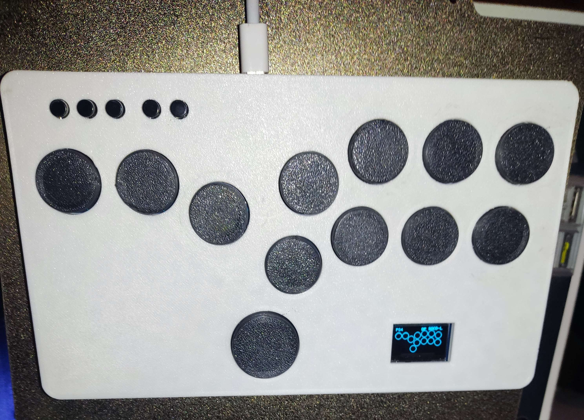

# FlatboxP: Flatbox rev5 fork 

This fork is now using WS2812B-V5 from JLC, which include capacitors inside the circuit and also operate on 3.3v logic from the RP2040.
Switch footprint supports Kaihl choc v1 and v2.

WARNING (1)!!!
If you see the extra thumb buttons on the pcb they're L3 AND R3 respectively for macro ease of use in SF6, however do note that I still have to work on the case (which I'll try making when I have more free time, meanwhile you're welcome to remix it yourself or try an acrylic enclosure)

WARNING (2)!!!
As of now the board should in theory be functional which is why I uploaded the files, however I still have some other ideas before I order them myself. Use at your own caution.

For the case I remixed Pettman's flatbox5 case to have a little window to show the active area of the screen.
I'll only upload the remixed top case here, go to their repo for details and the bottom plate:
https://github.com/pett-j/Flatbox-rev5-remix

I also recommend this model for the tact switch buttons:
https://www.printables.com/model/470120-flatbox-tactile-switch-button

Lastly for the buttons I recommend SGF's bridget buttons as they have a good model for v1s and v2s:
https://github.com/sgfdevices/Bridget/tree/main/Buttons

This repository contains a 3D-printable model, PCB design files to make an arcade controller that looks like this:

